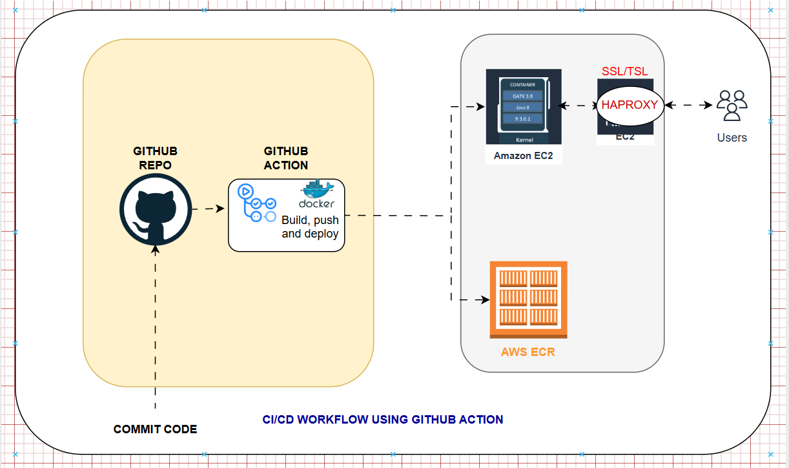

This project aims to automate the build and push of a Docker image to AWS ECR, and deploy the container to AWS EC2, utilising a CI/CD Git Action workflow. 
One of the requirements is to set up a reverse proxy (HAProxy ) with SSL (Let’s Encrypt) and connect it to a domain.

prerequisites on AWS

1. ECR Repository: An ECR repository named nedrone must exist in the specified AWS account and region.
2. EC2 IAM Role: The EC2 instance must have an IAM Role attached with a policy that grants permission to pull images from the ECR repository (e.g., AmazonEC2ContainerRegistryReadOnly).
3. Docker on EC2: Docker must be installed and running on the target EC2 instance.
4. Security Group: The EC2 instance's security group must allow inbound traffic on port 22 (SSH) from the GitHub Actions runner's IP ranges, and port 443 (HTTPS) from your intended users (e.g., 0.0.0.0/0).

STEP 1: Clone the remote repository to your local machine 
   (https://github.com/princenayo/nedrone.git)

STEP 2: Create a Dockerfile

STEP 3: Create a Git Action workflow
       (.github\workflow\cicd.yaml)

STEP 4:  Write your workflow configuration file  ( cicd.yml)

STEP 5: Required GitHub Secrets
For this workflow to function correctly, you must configure the following secrets in your GitHub repository (Settings > Secrets and variables > Actions):

  Secret Name	        Description
AWS_ACCESS_KEY_ID:	The Access Key ID for an IAM user with permissions to push to ECR.
AWS_SECRET_ACCESS_KEY:	The corresponding Secret Access Key for the IAM user.
AWS_REGION:	The AWS region where your ECR repository is located (e.g., us-east-1).
SSH_KEY: 	The private SSH key (in PEM format) used to authenticate with the EC2 instance.
EC2_USERNAME:	The username to use for SSH (e.g., ec2-user for Amazon Linux).
EC2_HOST:	The public IP address or public DNS of your EC2 instance.

STEP 6: Login to Amazon ECR
Uses the AWS CLI to retrieve a temporary password and logs the local Docker client into the private ECR registry.
The region (us-east-1) and account ID. For better reusability, these could be replaced with variables or secrets.

Then push your code to  GitHub repository (Using your desired branch)
This will trigger the workflow.
